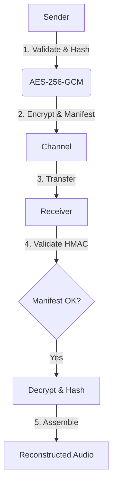

# Architecture

```mermaid
graph TD
    A[Sender] -->|1. Validate & Hash| B(AES-256-GCM)
    B -->|2. Encrypt & Manifest| C[Channel]
    C -->|3. Transfer| D[Receiver]
    D -->|4. Validate HMAC| E{Manifest OK?}
    E -->|Yes| F[Decrypt & Hash]
    F -->|5. Assemble| G[Reconstructed Audio]
```
