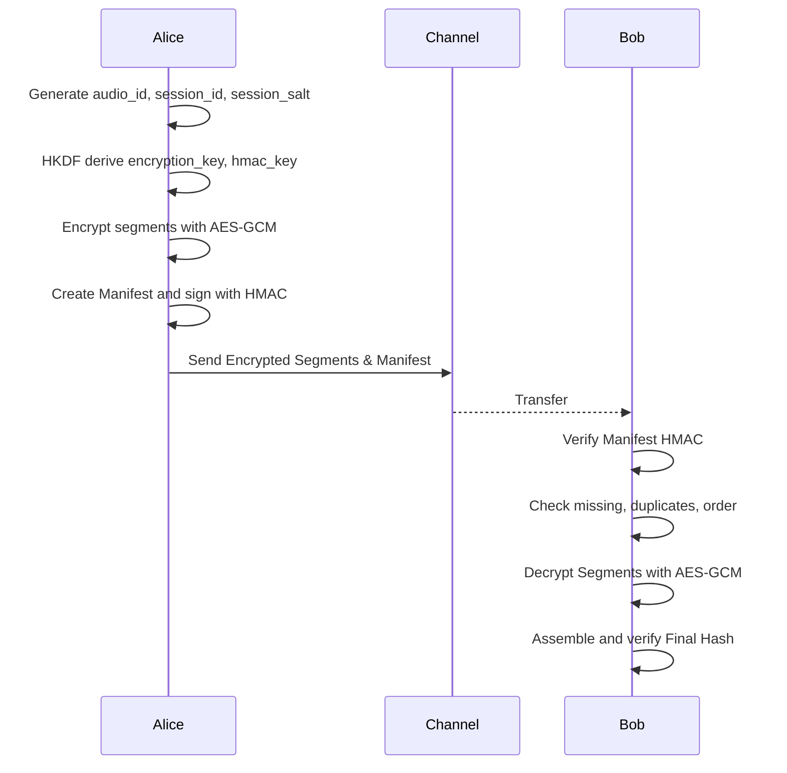

# Protocol Design

```mermaid
sequenceDiagram
    participant Alice
    participant Channel
    participant Bob
    
    Alice->>Alice: Generate audio_id, session_id, session_salt
    Alice->>Alice: HKDF derive encryption_key, hmac_key
    Alice->>Alice: Encrypt segments with AES-GCM
    Alice->>Alice: Create Manifest and sign with HMAC
    Alice->>Channel: Send Encrypted Segments & Manifest
    Channel-->>Bob: Transfer
    Bob->>Bob: Verify Manifest HMAC
    Bob->>Bob: Check missing, duplicates, order
    Bob->>Bob: Decrypt Segments with AES-GCM
    Bob->>Bob: Assemble and verify Final Hash
```
